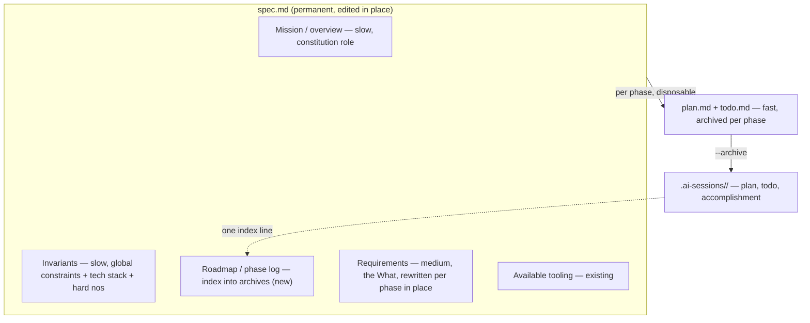

# BPE v0.7 Plan: Permanent Spec, Invariants, and Rule Vendoring

Status: design locked, implementation not started.
Blocked on: Fable budget. Do not start until there is Fable to spend on it.
Current version: 0.6.3. Target: 0.7.0.

## Why This Exists

This plan came out of comparing BPE against the Ng/Everitt spec-driven playbook (DeepLearning.AI x JetBrains, April 2026).
The comparison surfaced three things BPE was missing or doing implicitly: a permanent constitution-style layer, a first-class constraints block, and a first-class out-of-scope block.
Working through it also exposed that BPE's `spec.md` was quietly doing two jobs at two rates of change (mission-level intent and per-phase requirements), and that older specs were phase-shaped while the intended direction is a single permanent spec per repo.

v0.7 makes the permanent spec the real model, adds Invariants and out-of-scope as first-class, and defines how project rules get materialized from Mason's skills into a repo so they travel to collaborators who do not have those skills.

## Core Model: Pace Layering, One File

The spec is permanent, edited in place, and read fresh at the start of every session.
Do not make it cumulative or amendment-based; a spec that accumulates dated amendments grows without bound and eventually contradicts itself, which poisons every fresh read.
History lives where it already lives: in `.ai-sessions/<slug>/` archives, not inside the spec body.

Three rates of change, one file plus the existing archives:

The "constitution" is not a new file.
It is the two stable top sections of the same `spec.md` (Mission and Invariants).
A separate constitution file only earns its keep with multiple specs per repo (a monorepo of several apps inheriting one constitution).
BPE is one-spec-per-repo, so keep it as top matter and revisit only if BPE ever goes multi-spec-per-repo.

No renames anywhere. `spec.md` keeps its name and its embedding across skills, agents, and references. v0.7 adds sections and behavior, it does not rename the system.

## Locked Decisions

These were decided during the design session and should not be relitigated without reason.

1. Permanent `spec.md`, edited in place. Reject cumulative/amendment specs. Reject a separate constitution file for now.
2. Spec structure gains an Invariants section and a Roadmap / phase-log section (see the diagram above).
3. Brainstorm gains a merge mode for phase N+1: it detects an existing spec, runs Q&A for the new phase only, shows a diff of the merged requirements, and saves in place on confirm. Superseded requirements are rewritten, not appended.
4. The constraints pass and the out-of-scope pass both live in brainstorm, in the same generate-then-confirm idiom as the existing blindspot and tool-discovery passes.
5. Out-of-scope is generated by adjacency ("what would an eager agent bolt onto this feature"), capped at three to five per feature, and sorted by commitment: never (`## Non-goals`), not now (`**Deferred:**` in `## Roadmap / phase log`), or now (`## Goals`). Default is Deferred. It is a precision aid for the validator, not a completeness exercise, and it is durable: the same list is the backlog of likely future expansions. Revised 2026-09-14; see decision 11.
6. Constraints use a mix of formats: structured constraints the validator checks mechanically (for example `deps: frozen`, `paths: src/auth/**`), plus prose constraints the validator judges softly.
7. Perma-spec drift is handled by giving retrofit a second job: re-read the code, reconcile the spec to current reality, and re-vendor rules. Drift between resyncs is accepted.
8. Invariants are project-level law, materialized in the repo. They do not point to Mason's private global config, because a collaborator will not have it.
9. No separate Mission section: mission intent (what the project is, where it is going) lives in `## Project overview`. Locked 2026-09-14.
10. Superseded the same day by decision 11: out-of-scope does not live in `plan.md`. Plans are ephemeral and archived, so a per-plan list would be regenerated every phase and its durable value (the backlog of future expansions) thrown away each time. The canonical section order defined in `session-management.md` under "Spec Section Order (spec.md)" stands.
11. Out-of-scope lives in the spec as the `**Deferred:**` list of `## Roadmap / phase log`, beside `**Shipped:**` and `**Upcoming:**`. The scope fence for any phase is `## Non-goals` plus `**Deferred:**`; nothing phase-local lives outside the spec, and a plan's scope is the steps it contains. The never/later/now sort is confirmed in brainstorm, folded into the existing tool-discovery question (zero extra questions). A separate backlog file is deferred until the list proves long enough to bloat the spec. Locked 2026-09-14.
12. Vendoring is gated on the repo being shared, for every bucket, doc hygiene included. It is purely a sharing mechanism; on a solo or private repo nothing is written and Invariants names the governing skill in one line. Shared is decided by `gh repo view --json isPrivate`, falling back to LICENSE plus a public-host remote; fence-sitters go to the user inside the single confirm. Locked 2026-09-14.
13. Vendored files live in `.claude/rules/vendored/<domain>.md` and are verbatim copies of a "Hard Rules" block in the source (user-confirmed extract when the source has none). The author's sessions skip them via `"claudeMdExcludes": ["**/.claude/rules/vendored/**"]` in the repo's gitignored `.claude/settings.local.json`, written by brainstorm at vendoring time; the setting matches globs against absolute paths and covers rules files (code.claude.com/docs/en/memory, "Exclude specific CLAUDE.md files"). Per repo rather than user-level, so vendored rules in other people's repos still load for Mason. Locked 2026-09-14.
14. Checkable invariants are ordinary bullets with a fixed key prefix in the same list as prose rules: `- deps: frozen` and `- paths: <glob>[, <glob>]`, the whole vocabulary for now. The validator looks for those keys and treats every other bullet as prose. Locked 2026-09-14.
15. Vendoring sources are generic, not Mason-shaped: session skills, `~/.claude/rules/*.md`, and any file `~/.claude/CLAUDE.md` imports with `@path`. A source marked `never vendored` in its description or first line is excluded outright, and the vendoring part of the single confirm is omitted when the repo is private or nothing is vendorable. Observed 2026-09-18: the private writing refactor landed `@writing-hard-rules.md` in `~/.claude/CLAUDE.md`, which the import rule picks up with no BPE change specific to that layout. Locked 2026-09-18.
16. Fence enforcement is three layers, and the goal-mode playbook does not change. The plan writer drafts inside the fences; the executor self-checks the diff before reporting ready (interactive execute-plan and `mode=implement` alike); the validator checks on every dispatch it gets, reading spec.md itself. A section with `**Tools:** none` still gets no validator dispatch and relies on the executor self-check, which keeps the orchestrator playbook under its 4000-character cap and honors the plan writer's cost choice. Severities: `deps: frozen` and `paths:` violations block (mechanical, `git diff HEAD --name-only`); a prose Invariant blocks for a contract violation and warns for a pattern rule; a Non-goal implemented blocks; a Deferred item implemented warns, with promotion into Goals as the alternative fix. Rule ids `spec.deps-frozen`, `spec.paths`, `spec.invariant`, `spec.non-goal`, `spec.deferred`; no schema change, `rule` is free text. Locked 2026-09-18.

## Invariants and Rule Vendoring

The central problem: Mason wants project docs written in his rules by collaborators' agents, without assuming those collaborators have his private skills, and without copying every rule into every project.

### Two Channels

There are two consumers, and they need different homes.

- `spec.md` Invariants: read and enforced by the BPE loop (brainstorm, plan, execute, validator).
- Committed `.claude/rules/*.md` or the repo's `CLAUDE.md`: auto-loaded by every agent working in the repo, including a collaborator's agent and any non-BPE session.

Collaborator compliance is the second channel's job. Claude Code auto-loads a repo's committed rules for anyone in that repo, so rules reach a collaborator's agent the moment they are committed, and never if they only live in `~/.claude`.

The distinction that unlocks this: pointing to a private global file is dead (not portable), but pointing to a committed repo file is fine (travels with the repo, still project-level, still law). Spec Invariants can reference a committed rules file rather than duplicating its text.

### Vendoring Model

Mason's skills are source. The committed repo files are frozen build output. Brainstorm is the compiler. Retrofit-resync is the recompile.

When Mason authors with his skills present, brainstorm extracts the output-constraining rules from the relevant skills (not the whole skill) and freezes them into the repo. A collaborator later gets the frozen rules with the repo and needs none of Mason's skills. Staleness is the accepted cost of vendoring; retrofit-resync refreshes the frozen copies from current skills.

### Three Buckets

Classify each candidate rule by authority scope. Relevance is decided by which artifact classes the project actually produces.

- Always vendor (law): project-intrinsic plus domain-craft rules matching the project's artifact classes. Python style for a Python project, the code-sandwich rule for a tutorial repo, no-new-deps. These land in spec Invariants and/or a committed rules file.
- Conditionally vendor: universal doc-hygiene (anti-AI-tell vocabulary, punctuation, one-sentence-per-line, plain voice). Vendor only when docs are a primary artifact and the repo is shared.
- Never vendor: personal-identity rules (Mason's authentic blog voice). A collaborator should not ghost-write project docs in his voice. Stays global, applies only when Mason personally authors.

Every bucket is gated on the repo being shared (decision 12). Vendoring exists so a contributor's agent conforms automatically; on a repo nobody else touches it would only duplicate Mason's live skills in his own context, so nothing is written there.

Vendored files are verbatim copies into `.claude/rules/vendored/`, and Mason's own sessions skip that directory through a per-repo `claudeMdExcludes` in the gitignored `.claude/settings.local.json` (decision 13). That is what makes vendoring free for him: contributors load the copy, he loads only the source.

### Writing Style, Specifically

Split it, because it is two things under one name.

- Authentic voice (blog, his name on it): personal identity, bucket three, never vendored.
- Doc hygiene (no em-dashes, no tell-vocabulary, structure, plain prose): a legitimate project documentation standard, bucket two.

For a doc-heavy shared project, commit the hygiene subset to `.claude/rules/writing.md`, reference it from spec Invariants, and enforce it two ways: Vale as a Linter in the plan's doc-section Tools block (the mechanical, exit-0 path that already exists), plus a soft validator check for what Vale cannot see. For a solo code repo, none of this fires and the spec stays lean.

### Bucket-Two Default Heuristic

Do not ask about doc-hygiene vendoring every time. Brainstorm is already long. Decide from signals brainstorm already computes, and only prompt on genuine ambiguity.

- Auto-vendor when prose docs are a primary artifact class AND the repo is shared (public remote, or a LICENSE present).
- Auto-skip when docs are incidental (a README as formality) OR the repo is solo/private.
- Ask only the fence-sitter case: shared repo, docs exist, but not clearly primary.

When a confirm does fire, it piggybacks on the tool-discovery question brainstorm already asks. It does not become its own pass. Common case gains zero new questions.

## Reconnaissance (2026-08-15)

Reading `bpe/skills/retrofit/SKILL.md` before starting changed two assumptions.

- Out-of-scope is not greenfield. Retrofit already asks an "out of scope" question in its shortened Q&A and writes a `## Non-goals` section; brainstorm has neither. So the v0.7 out-of-scope work is a reconciliation, not an addition. Two distinct concepts have to stay separate: `Non-goals` (never) and the adjacency-generated candidates (not now, which live in `**Deferred:**`; decision 11). Do not collapse them.
- The constraint-from-manifest hook already exists. Retrofit step 2 ("Read repo state") already reads package.json, pyproject.toml, go.mod, and Cargo.toml, so deriving constraints from the lockfile attaches to existing behavior rather than new plumbing.
- Both skills must emit one identical spec structure, because `/bpe:plan` consumes either without knowing which wrote it. Retrofit's current section list (`Starting context`, `Project overview`, `Available tooling`, `Goals`, `Non-goals`, `Component boundaries`, `Success criteria`) is the concrete target the new Invariants and phase-log sections extend (mission intent folds into `Project overview`; there is no separate Mission section). Design the structure once, apply to both.
- Retrofit already has a `--replace` flag (overwrite). Resync is a distinct mode (reconcile), not a rename of `--replace`.

## Change Set by File

1. `bpe/skills/brainstorm/SKILL.md` (landed 2026-09-14 across two commits)
   - Spec structure: Invariants and Roadmap / phase log in the saved order (step 1).
   - Merge mode: detect an existing spec, phase-only Q&A, diff to a scratch file, save in place on confirm; no overwrite flag.
   - Constraints pass: negate stated choices plus stated non-negotiables into `deps:`/`paths:` and prose candidates.
   - Adjacency pass: three to five neighbors per goal, sorted never/later/now with Deferred as the default.
   - One four-part confirm (tools, invariants, scope sort, vendoring) replacing the old tools-only question; the verification-command question folds in too.
   - Vendoring: shared-repo gate, three buckets, verbatim copy into `.claude/rules/vendored/`, Invariants pointers, author exclusion in `.claude/settings.local.json`.
   - 2026-09-18: generic source discovery (decision 15), `never vendored` opt-out, vendoring part omitted when empty, "Hard Rules" casing.

2. `bpe/skills/retrofit/SKILL.md` (landed 2026-09-18; structure on 2026-09-14)
   - Adopt brainstorm's four-part confirm inline (tools, invariants, scope sort, vendoring) and its Adjacency pass, so "the same pass brainstorm runs" is true again.
   - Match the new spec structure (Invariants, phase log; mission folded into Project overview), extending the existing section list so brainstorm and retrofit stay identical for `/bpe:plan` (see Reconnaissance).
   - Derive constraint candidates from the repo's manifest and lockfile (higher signal than negating interview answers). Attach to the existing step 2 read; no new plumbing.
   - Reconcile out-of-scope with the existing `## Non-goals` section: retrofit's step 4 out-of-scope answers split into never (`## Non-goals`) and not now (`**Deferred:**`). Keep them distinct.
   - Add resync mode beside the existing `--replace` flag: reconcile the spec to current code and re-vendor rules, rather than overwriting.

3. `bpe/skills/plan/SKILL.md`
   - No out-of-scope block (decision 11). Plan reads `## Invariants`, `## Non-goals`, and `**Deferred:**` and writes no step that violates or implements them.
   - `--archive` routine appends one `**Shipped:**` line to the spec's `## Roadmap / phase log` pointing at the new `.ai-sessions/<slug>/` archive.

4. `bpe/skills/execute-plan/SKILL.md` (landed 2026-09-18, with the same check in `step-executor-protocol.md` for `mode=implement`)
   - Add a light end-of-step self-check against the spec's `## Invariants`, `## Non-goals`, and `**Deferred:**`, since the validator only runs in goal mode.

5. `bpe/references/validator-protocol.md` and `bpe/agents/validator.md` (landed 2026-09-18)
   - Add two checks: diff violates an Invariant (new dependency, out-of-bounds path: mechanical for structured constraints, soft for prose), and diff implements anything listed in the spec's `## Non-goals` or `**Deferred:**`.
   - Define the structured-vs-prose constraint handling in the findings flow.

6. `bpe/references/session-management.md` and the accomplishment.md template
   - Define the phase-log line format.
   - Record each phase's spec delta or commit range so an archive is self-contained without git archaeology.

7. Convention docs
   - Document the committed `.claude/rules/` channel and Vale wiring, cross-referencing `content-design:style-linting`.

8. Release (`README.md`, `bpe/README.md`, `bpe/.claude-plugin/plugin.json`, `.claude-plugin/marketplace.json`)
   - README pass: the nine-section spec, merge mode, the `deps:`/`paths:` invariant vocabulary, Deferred, and exactly what vendoring writes and where the author's exclusion lives.
   - Bump to 0.7.0 (a minor bump: additive with compatibility shims, but brainstorm's behavior and the spec shape both change).
   - PR to main.

## Backwards Compatibility

New sections are optional. When a spec lacks Invariants or a phase log, the tooling behaves exactly as it does in 0.6.x, the same way `plan.md` already honors the legacy `**Validator consults:**` block. No forced migration of existing repos. Older phase-shaped specs keep working; Mason can retrofit-resync them into the new shape when he wants to.

## Deferred

- Promotion path from a recurring `lessons.md` entry to a spec Invariant. Note it, do not build it in v0.7.
- Separate constitution file. Only revisit at multi-spec-per-repo.
- `--refresh-discover` flag for external tool discovery (already noted as future work in `plan/SKILL.md`).
- Add a "Hard Rules" block to Mason's python skill and writing sources so vendoring is a verbatim copy rather than a confirmed extract. Lives in his private config repo, outside this plugin.

## Resume Entry Point

When there is Fable to spend:

1. Read this file.
2. `bpe/skills/retrofit/SKILL.md` and `bpe/references/session-management.md` were reviewed on 2026-08-15; the findings are folded into the Reconnaissance section above. Re-skim retrofit before editing it.
3. Start with the new spec structure in `bpe/skills/brainstorm/SKILL.md`, since everything keys off what a spec now contains. Get eyes on that before touching retrofit, plan, execute-plan, and the validator.
4. Create a feature branch. Do not work on main.
