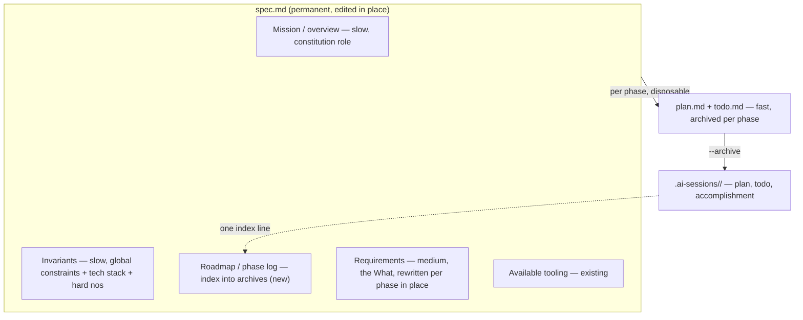

# BPE v0.7 Plan: Permanent Spec, Invariants, and Rule Vendoring

Status: design locked, implementation not started.
Blocked on: Fable budget. Do not start until there is Fable to spend on it.
Current version: 0.6.3. Target: 0.7.0.

## Why This Exists

This plan came out of comparing BPE against the Ng/Everitt spec-driven playbook (DeepLearning.AI x JetBrains, April 2026).
The comparison surfaced three things BPE was missing or doing implicitly: a permanent constitution-style layer, a first-class constraints block, and a first-class out-of-scope block.
Working through it also exposed that BPE's `spec.md` was quietly doing two jobs at two rates of change (mission-level intent and per-phase requirements), and that older specs were phase-shaped while the intended direction is a single permanent spec per repo.

v0.7 makes the permanent spec the real model, adds Invariants and out-of-scope as first-class, and defines how project rules get materialized from Mason's skills into a repo so they travel to collaborators who do not have those skills.

## Core Model: Pace Layering, One File

The spec is permanent, edited in place, and read fresh at the start of every session.
Do not make it cumulative or amendment-based; a spec that accumulates dated amendments grows without bound and eventually contradicts itself, which poisons every fresh read.
History lives where it already lives: in `.ai-sessions/<slug>/` archives, not inside the spec body.

Three rates of change, one file plus the existing archives:

The "constitution" is not a new file.
It is the two stable top sections of the same `spec.md` (Mission and Invariants).
A separate constitution file only earns its keep with multiple specs per repo (a monorepo of several apps inheriting one constitution).
BPE is one-spec-per-repo, so keep it as top matter and revisit only if BPE ever goes multi-spec-per-repo.

No renames anywhere. `spec.md` keeps its name and its embedding across skills, agents, and references. v0.7 adds sections and behavior, it does not rename the system.

## Locked Decisions

These were decided during the design session and should not be relitigated without reason.

1. Permanent `spec.md`, edited in place. Reject cumulative/amendment specs. Reject a separate constitution file for now.
2. Spec structure gains an Invariants section and a Roadmap / phase-log section (see the diagram above).
3. Brainstorm gains a merge mode for phase N+1: it detects an existing spec, runs Q&A for the new phase only, shows a diff of the merged requirements, and saves in place on confirm. Superseded requirements are rewritten, not appended.
4. The constraints pass and the out-of-scope pass both live in brainstorm, in the same generate-then-confirm idiom as the existing blindspot and tool-discovery passes.
5. Out-of-scope is phase-local: generated by adjacency ("what would an eager agent bolt onto this feature"), capped at three to five per feature, default is out. It is a precision aid for the validator, not a completeness exercise. Its output is phase-scoped and does not clutter the permanent spec body.
6. Constraints use a mix of formats: structured constraints the validator checks mechanically (for example `deps: frozen`, `paths: src/auth/**`), plus prose constraints the validator judges softly.
7. Perma-spec drift is handled by giving retrofit a second job: re-read the code, reconcile the spec to current reality, and re-vendor rules. Drift between resyncs is accepted.
8. Invariants are project-level law, materialized in the repo. They do not point to Mason's private global config, because a collaborator will not have it.

## Invariants and Rule Vendoring

The central problem: Mason wants project docs written in his rules by collaborators' agents, without assuming those collaborators have his private skills, and without copying every rule into every project.

### Two Channels

There are two consumers, and they need different homes.

- `spec.md` Invariants: read and enforced by the BPE loop (brainstorm, plan, execute, validator).
- Committed `.claude/rules/*.md` or the repo's `CLAUDE.md`: auto-loaded by every agent working in the repo, including a collaborator's agent and any non-BPE session.

Collaborator compliance is the second channel's job. Claude Code auto-loads a repo's committed rules for anyone in that repo, so rules reach a collaborator's agent the moment they are committed, and never if they only live in `~/.claude`.

The distinction that unlocks this: pointing to a private global file is dead (not portable), but pointing to a committed repo file is fine (travels with the repo, still project-level, still law). Spec Invariants can reference a committed rules file rather than duplicating its text.

### Vendoring Model

Mason's skills are source. The committed repo files are frozen build output. Brainstorm is the compiler. Retrofit-resync is the recompile.

When Mason authors with his skills present, brainstorm extracts the output-constraining rules from the relevant skills (not the whole skill) and freezes them into the repo. A collaborator later gets the frozen rules with the repo and needs none of Mason's skills. Staleness is the accepted cost of vendoring; retrofit-resync refreshes the frozen copies from current skills.

### Three Buckets

Classify each candidate rule by authority scope. Relevance is decided by which artifact classes the project actually produces.

- Always vendor (law): project-intrinsic plus domain-craft rules matching the project's artifact classes. Python style for a Python project, the code-sandwich rule for a tutorial repo, no-new-deps. These land in spec Invariants and/or a committed rules file.
- Conditionally vendor: universal doc-hygiene (anti-AI-tell vocabulary, punctuation, one-sentence-per-line, plain voice). Vendor only when docs are a primary artifact and the repo is shared.
- Never vendor: personal-identity rules (Mason's authentic blog voice). A collaborator should not ghost-write project docs in his voice. Stays global, applies only when Mason personally authors.

### Writing Style, Specifically

Split it, because it is two things under one name.

- Authentic voice (blog, his name on it): personal identity, bucket three, never vendored.
- Doc hygiene (no em-dashes, no tell-vocabulary, structure, plain prose): a legitimate project documentation standard, bucket two.

For a doc-heavy shared project, commit the hygiene subset to `.claude/rules/writing.md`, reference it from spec Invariants, and enforce it two ways: Vale as a Linter in the plan's doc-section Tools block (the mechanical, exit-0 path that already exists), plus a soft validator check for what Vale cannot see. For a solo code repo, none of this fires and the spec stays lean.

### Bucket-Two Default Heuristic

Do not ask about doc-hygiene vendoring every time. Brainstorm is already long. Decide from signals brainstorm already computes, and only prompt on genuine ambiguity.

- Auto-vendor when prose docs are a primary artifact class AND the repo is shared (public remote, or a LICENSE present).
- Auto-skip when docs are incidental (a README as formality) OR the repo is solo/private.
- Ask only the fence-sitter case: shared repo, docs exist, but not clearly primary.

When a confirm does fire, it piggybacks on the tool-discovery question brainstorm already asks. It does not become its own pass. Common case gains zero new questions.

## Change Set by File

1. `bpe/skills/brainstorm/SKILL.md`
   - Add Invariants and Roadmap / phase-log to the saved spec structure.
   - Add merge mode: detect an existing spec, run phase-only Q&A, show a diff, save in place on confirm.
   - Add the constraints pass (negation of stated choices into structured/prose candidates, confirm) and the out-of-scope pass (adjacency, capped, default out).
   - Add vendoring: three-bucket classification, bucket-two heuristic, extract rules from relevant skills, materialize to spec Invariants and/or committed `.claude/rules/`.
   - Fold the vendor confirms into the existing tool-discovery question.

2. `bpe/skills/retrofit/SKILL.md`
   - Match the new spec structure (Invariants, phase log).
   - Derive constraint candidates from the repo's manifest and lockfile (higher signal than negating interview answers).
   - Add resync mode: reconcile the spec to current code, re-vendor rules.

3. `bpe/skills/plan/SKILL.md`
   - Add a phase-local out-of-scope block per section, alongside the existing Tools block.
   - `--archive` routine appends one phase-log line to the spec pointing at the new `.ai-sessions/<slug>/` archive.

4. `bpe/skills/execute-plan/SKILL.md`
   - Add a light end-of-step self-check against Invariants and the plan's out-of-scope list, since the validator only runs in goal mode.

5. `bpe/references/validator-protocol.md`
   - Add two checks: diff violates an Invariant (new dependency, out-of-bounds path: mechanical for structured constraints, soft for prose), and diff implements anything on the plan's out-of-scope list.
   - Define the structured-vs-prose constraint handling in the findings flow.

6. `bpe/references/session-management.md` and the accomplishment.md template
   - Define the phase-log line format.
   - Record each phase's spec delta or commit range so an archive is self-contained without git archaeology.

7. Convention docs
   - Document the committed `.claude/rules/` channel and Vale wiring, cross-referencing `content-design:style-linting`.

## Backwards Compatibility

New sections are optional. When a spec lacks Invariants or a phase log, the tooling behaves exactly as it does in 0.6.x, the same way `plan.md` already honors the legacy `**Validator consults:**` block. No forced migration of existing repos. Older phase-shaped specs keep working; Mason can retrofit-resync them into the new shape when he wants to.

## Deferred

- Promotion path from a recurring `lessons.md` entry to a spec Invariant. Note it, do not build it in v0.7.
- Separate constitution file. Only revisit at multi-spec-per-repo.
- `--refresh-discover` flag for external tool discovery (already noted as future work in `plan/SKILL.md`).

## Resume Entry Point

When there is Fable to spend:

1. Read this file.
2. Read `bpe/skills/retrofit/SKILL.md` and `bpe/references/session-management.md` in full first; they change under this design and were not fully reviewed during the design session.
3. Start with the new spec structure in `bpe/skills/brainstorm/SKILL.md`, since everything keys off what a spec now contains. Get eyes on that before touching retrofit, plan, execute-plan, and the validator.
4. Create a feature branch. Do not work on main.
